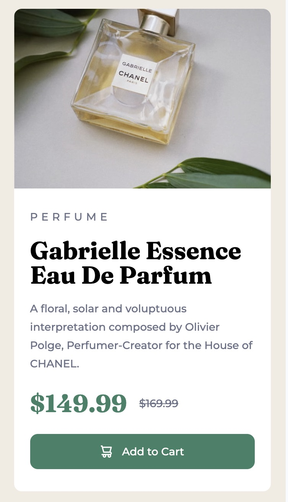
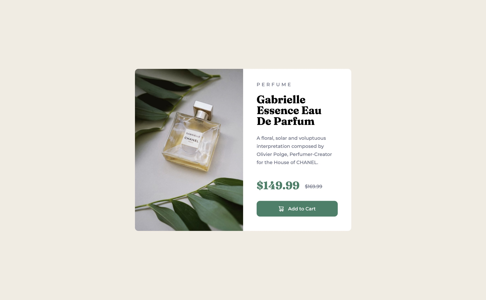

# Frontend Mentor - Product preview card component solution

This is a solution to the [Product preview card component challenge on Frontend Mentor](https://www.frontendmentor.io/challenges/product-preview-card-component-GO7UmttRfa). Frontend Mentor challenges help you improve your coding skills by building realistic projects.

## Table of contents

-   [Overview](#overview)
    -   [The challenge](#the-challenge)
    -   [Screenshot](#screenshot)
    -   [Links](#links)
-   [My process](#my-process)
    -   [Built with](#built-with)
    -   [What I learned](#what-i-learned)
    -   [Continued development](#continued-development)

## Overview

### The challenge

I attempted to use "rem" instead of "px" to achieve better responsive design.

### Screenshot




### Links

-   Solution URL: [Add solution URL here](https://your-solution-url.com)
-   Live Site URL: [Add live site URL here](https://your-live-site-url.com)

## My process

### Built with

-   Semantic HTML5 markup
-   CSS custom properties
-   Flexbox
-   Mobile-first workflow

### What I learned

I learned how to switch images based on the device size.

```html

```

```css
.product-image {
    width: 100%;
    height: auto;
    object-fit: contain;
}
@media (min-width: 47rem) {
    .product-image {
        content: url("images/image-product-desktop.jpg");
        width: 50%;
    }
}
```

### Continued development

I will continue learning about "rem" and "em" and apply them to other elements to achieve better responsive design.
# product-preview-card-main
